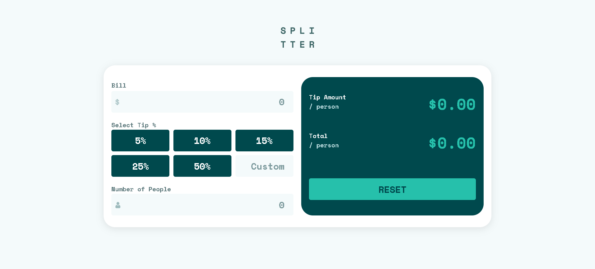
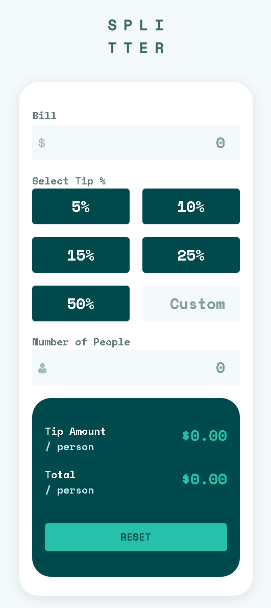

# Frontend Mentor - Tip Calculator App Solution

This is my solution to the [Tip Calculator App challenge on Frontend Mentor](https://www.frontendmentor.io/challenges/tip-calculator-app-ugJNGbJUX). This challenge helped me improve my skills in building interactive and responsive web applications.

## Table of Contents

- [Overview](#overview)
  - [The Challenge](#the-challenge)
  - [Screenshot](#screenshot)
  - [Links](#links)
- [My Process](#my-process)
  - [Built With](#built-with)
  - [What I Learned](#what-i-learned)
  - [Continued Development](#continued-development)
  - [Useful Resources](#useful-resources)
- [Author](#author)

## Overview

### The Challenge

Users can:

- View the optimal layout for the app depending on their device's screen size.
- See hover states for all interactive elements on the page.
- Calculate the correct tip and total cost of the bill per person.

### Screenshot

### Links

- [Solution URL](https://github.com/ffozdemir/tip-calculator-app)
- [Live Site URL](https://jovial-cassata-d06b41.netlify.app)

## My Process

### Built With

- Semantic HTML5
- CSS custom properties
- Flexbox
- CSS Grid
- Mobile-first workflow
- Vanilla JavaScript

### What I Learned

This project helped me strengthen my understanding of responsive design and JavaScript DOM manipulation.

### Continued Development

In future projects, I aim to:

- Explore more advanced JavaScript concepts like state management.
- Improve accessibility features in my applications.
- Experiment with CSS frameworks like Tailwind CSS.

### Useful Resources

- [MDN Web Docs](https://developer.mozilla.org/) - A great resource for understanding JavaScript and CSS concepts.
- [CSS Tricks](https://css-tricks.com/) - Helped me refine my CSS Grid and Flexbox skills.

## Author

- Frontend Mentor - [@ffozdemir](https://www.frontendmentor.io/profile/ffozdemir)
- GitHub - [@ffozdemir](https://github.com/ffozdemir)

